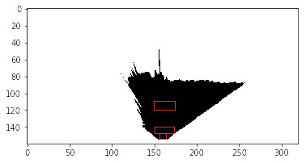

# Search and Sample Return Project
 

## Notebook Analysis
### Obstacle identification
To perform identification of obstacles I used the colors of them. Considering the RGB, I compared the RGB of each pixel with a threshold. To a pixel be an obstacle it got to have the red under 160, green under 160 and blue under 160. If these three conditions are observed, a new image receive a white point in this position.
It can be found in notebook (def obstacle_detection).

### Rock identification
The def rock_detection, also in the notebook, use the same ‘obstacle identification’ technique. But now, I used a low and a high threshold, and the pixel got to have its RGB values inside the thresholds. The thresholds were founded using the sample rock image and photoshop, and they are: 130 < red < 160, 130 < green < 160, 0 < blue < 40.

### Process image
The main improvement in the process_image function was the addition of a map. To construct the map the warp image is used, where it's applied rover_coords and pix_to_worldmap, this way, the coords found can be added as RGB pixels to the data.worldmap. Some text describing what each image represent was added. All this is in the notebook.

## Autonomous navigation and mapping
### Mapping
The perception.py is very important, because is there where we give to the rover the ability to understand the environment using just a camera in its front.
To do this, some steps are made:

1) The camera image is transformed to a new perspetive, this new perspective is called bird’s view.

2) Using the color_thresh, obstacle_detection and rock_detection functions, the rover is able to know what it is seeing. It’s important because we don’t want the rover beating obstacles or walls, and we want to know where are the rocks.

3) Here we update the Rover.vision_image, to show in the sim how the image camera is being processed. 

4) Using the rover_coords we put the transformed image in new coordinates, that are relative to the rover center. 

5) At this point, we already have a image that has information about what is navigable terrain, rocks and obstacles. Now, we put all this in a map using the pix_to_world function. To do that, we need to know where is the rover and its yaw orientation. As the world map is 10 times smaller than the camera image, this scale also should be applied. 

6) Using the information about where the image should be in the world map, we add some blue color to the terrain and green to the rocks. Using the numpy.flipud the image is inverted, just to match with the sample map given.

7) I feed two variables with the polar coordinates of what is terrain, to know that the to_polar_coords function is used.

8) A ‘terrain’ variable receive the information about where the rover can navigate.

The mapping task do a really good job, if you run the drive_rover.py you will see the map being constructed exactly in the same place of the reference map. All the code is in the perception.py.

### Autonomous navigation
This was the most difficult task. Mainly, because I tried to do a navigation of all the environment, and this was challenger. I deleted all the given code and started from scratch. I’ve used a decision tree like this:

-> Moving -> yes -> clear path? -> yes -> find best direction -> steer to there -> max velocity? -> yes -> throttle = 0

							                                          -> no -> throttle = 0.5
                                                                      
				    -> no  -> hit brakes!!
                    
	  

	  -> no -> clear path? -> yes -> find best direction -> steer to there -> throttle = 0.5
      
				 -> no -> steer to the right
                 

to perform this tree I code some functions: 

-> is_clear: this function looks if what is in the rover front is navigable terrain. To do that, I use the ‘terrain’ variable that has information about where the rover can navigate, I perform a sum of the elements in front of the rover. 

In the image above we see the areas used to know if the rover front is clear, those areas should be almost just terrain to the function return true.

-> throttle

If the Rover is under its maximum velocity, throttle!! Otherwise, throttle gets 0.

-> best_way

This function looks for the best way to go, and it is performed using the direction where the rover has more terrain available to go. If this angle is higher than 0.1 rad, the rover goes to the left, if lower than -0.1 rad, it goes to the right, otherwise, it goes forward.

-> stop

To stop the rover, we brake it, and set the steer and throttle to 0.

And the decision tree is in the decision_step. All the code is in the decision.py.

 Running the code we can see the rover going well in the navigation task without hitting, and to try to visit all the environment. Using the idea of going always to the same side when it is stucked, the rover can map all the environment almost always. But sometimes it gets in a loop.